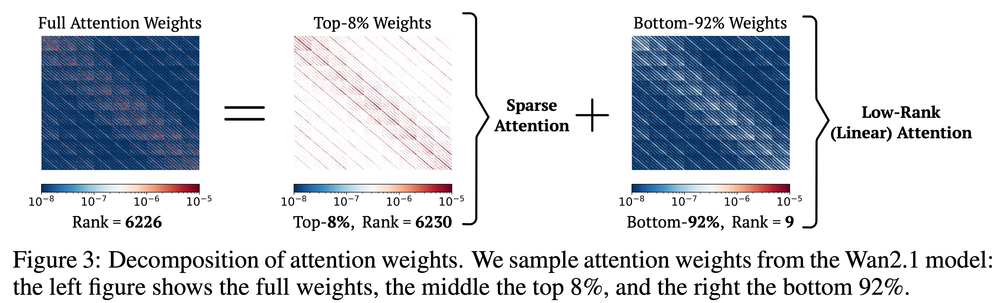

# SLA
This repository provides the implementation of [SLA](https://www.arxiv.org/pdf/2509.24006) (Sparse–Linear Attention), a trainable attention method that fuses sparse and linear attention to accelerate diffusion models.

SLA: Beyond Sparsity in Diffusion Transformers via Fine-Tunable Sparse–Linear Attention  
Jintao Zhang, Haoxu Wang, Kai Jiang, Shuo Yang, Kaiwen Zheng, Haocheng Xi, Ziteng Wang, Hongzhou Zhu, Min Zhao, Ion Stoica, Joseph E. Gonzalez, Jun Zhu, Jianfei Chen  
Paper: https://www.arxiv.org/pdf/2509.24006  


### Motivation


### Effectiveness


### Efficiency


### Installation

```bash
git clone https://github.com/thu-ml/SLA.git
cd SLA
pip install -e .
```

### Usage

```python
import torch
from sparse_linear_attention import SparseLinearAttention

attn = SparseLinearAttention(
    head_dim=128,
    topk=0.2,                 # = 1 - sparsity
    feature_map="softmax",    # options: elu, relu, softmax
    BLKQ=64,
    BLKK=64,
).cuda()

B, H, L, D = 2, 4, 4096, 128
q = torch.randn((B, H, L, D), dtype=torch.bfloat16, device='cuda')
k = torch.randn((B, H, L, D), dtype=torch.bfloat16, device='cuda')
v = torch.randn((B, H, L, D), dtype=torch.bfloat16, device='cuda')

o = attn(q, k, v)
```

### SageSLA

We provide a fast quantized implementation using [SpargeAttn](https://github.com/thu-ml/SpargeAttn) of the forward pass of SLA, please refer to the `SageSLA/` directory.

## Citation

If you find this work useful, please cite:

```bibtex
@article{zhang2025sla,
  title={SLA: Beyond Sparsity in Diffusion Transformers via Fine-Tunable Sparse-Linear Attention},
  author={Zhang, Jintao and Wang, Haoxu and Jiang, Kai and Yang, Shuo and Zheng, Kaiwen and Xi, Haocheng and Wang, Ziteng and Zhu, Hongzhou and Zhao, Min and Stoica, Ion and Gonzalez, Joseph E. and Zhu, Jun and Chen, Jianfei},
  journal={arXiv preprint arXiv:2509.24006},
  year={2025}
}
```
